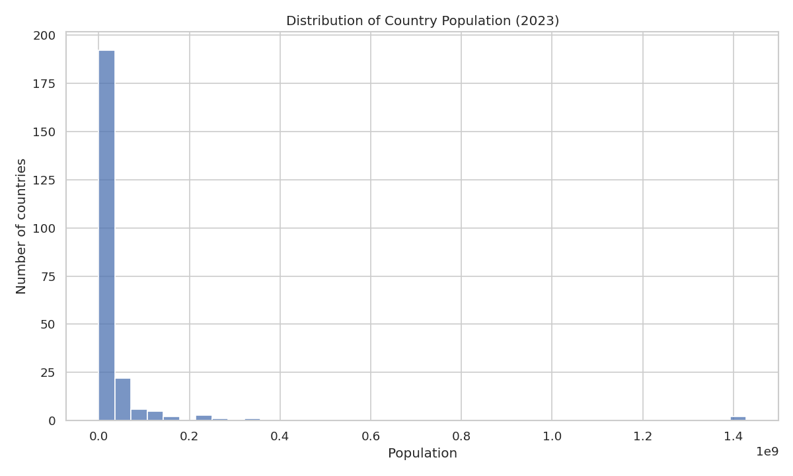
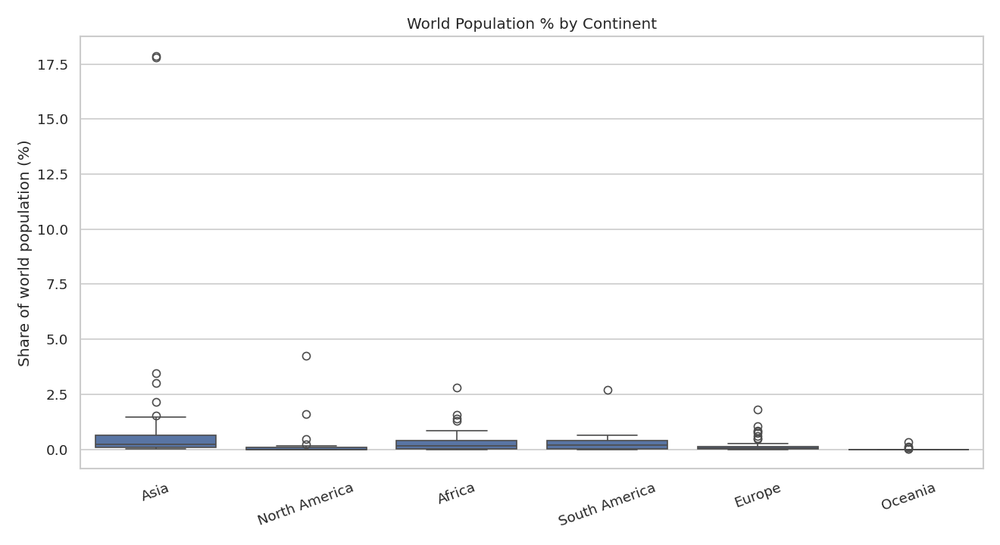
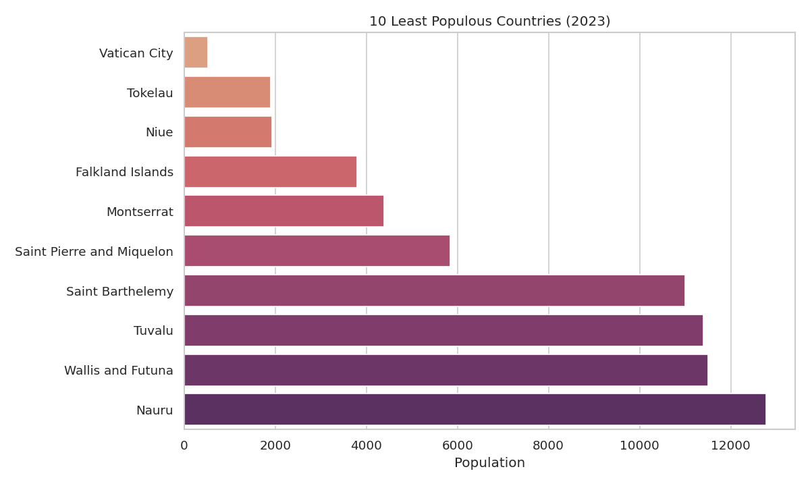

# World Population Analysis
SQL Analysis and Python Visualisation

An end-to-end population analytics project examining global demographic patterns across 234 countries and more than 3,900 data points.

The project uses MySQL for data preparation, aggregation, ranking, and analytical queries, while Python converts the results into clear visualisations.


Project Overview

This project analyses a global population dataset containing historical and current demographic information for 234 countries.

The analysis transforms raw population data into structured insights that can support:

* Demand forecasting
* Market prioritisation
* Logistics network planning
* Warehouse and distribution-centre placement
* Capacity and infrastructure planning
* Regional expansion strategy
* Long-term operational decision-making

The project combines SQL-based analysis with Python visualisation to identify population concentration, regional growth, density patterns, historical trends, and country-level differences.


Business Relevance

Population is an important indicator of potential demand, resource requirements, infrastructure pressure, and market scale.

Population intelligence can support decisions related to:

* Distribution-network design
* Transportation planning
* Inventory allocation
* Service-capacity planning
* Urban and regional demand segmentation
* Market-entry assessment
* Infrastructure investment
* Long-term demand growth

The analysis connects demographic information with practical operations and supply-chain considerations.


Dataset

The dataset contains information for 234 countries.

Main Variables

* Country
* Continent
* Country rank
* Area
* Population density
* Population growth rate
* World population percentage
* 1970 population
* 1980 population
* 1990 population
* 2000 population
* 2010 population
* 2015 population
* 2020 population
* 2022 population
* 2023 population

The `growth rate` and `world percentage` fields originally contain percentage symbols. These fields are cleaned during the loading process and stored as numerical values for analysis.


Technologies Used

 Database

* MySQL

Programming Language

* Python 

Python Libraries

* pandas
* NumPy
* Matplotlib
* Seaborn
* SQLAlchemy
* mysql-connector-python

Skills Demonstrated

SQL

* Database and table creation
* CSV data loading
* Data-quality validation
* Filtering and sorting
* Aggregate functions
* `GROUP BY` analysis
* Common calculations
* Country and continent-level ranking
* Window functions
* Historical growth calculations
* Multi-period population comparison

Python

* Database connectivity
* Query-result extraction
* Data transformation
* Statistical visualisation
* Chart customisation


Data Analytics

* Exploratory data analysis
* Missing-value checks
* Duplicate detection
* Distribution analysis
* Outlier interpretation
* Group-level comparison
* Trend analysis
* Multi-variable analysis
* Business-focused insight generation

Project Structure

```text
world-population-analysis/
│
├── 01_schema_and_load.sql
├── 02_analysis_queries.sql
├── visualize.py
├── world_population.csv
├── requirements.txt
├── charts/
│   ├── chart1_population_histogram.png
│   ├── chart2_worldpct_by_continent.png
│   ├── chart3_least_populous.png
│   ├── chart4_density_growth_scatter.png
│   ├── chart5_multidimensional_scatter.png
│   └── chart6_population_variability.png
└── README.md
```

---

File Description

`01_schema_and_load.sql`

Creates the MySQL database and population table.

The script performs the following tasks:

* Creates the `world_population` database
* Defines the population table
* Assigns suitable data types
* Loads the CSV dataset
* Removes percentage symbols
* Converts percentage-based fields into numerical values

`02_analysis_queries.sql`

Contains the SQL queries used for:

* Data-quality checks
* Summary statistics
* Country rankings
* Continent-level aggregation
* Population-density analysis
* Growth-rate comparison
* Historical population analysis
* Window-function calculations

`visualize.py`

Connects Python to the MySQL database, executes selected analytical queries, and saves the resulting charts in the `charts/` folder.

 `world_population.csv`

Contains the original population dataset for 234 countries and territories.

`requirements.txt`

Contains the Python packages required to run the project.

`charts/`

Stores all generated PNG visualisations.

---

Analysis Performed

The project covers the following areas:

* Missing-value identification
* Duplicate-country detection
* Summary statistics for the 2023 population
* Largest and smallest national populations
* Population density comparison
* Population contribution by continent
* Average growth rate by continent
* Fastest-growing countries
* Countries with declining populations
* Global population change from 1970 to 2023
* Country-level growth rankings
* Population-share variability within continents


 Visualisations and Operational Insights

1. Distribution of the 2023 Population

Visualisation

Histogram

 Purpose

The histogram displays the frequency distribution of country-level population values for 2023.

 Analytical Value

A histogram helps identify:

* Distribution shape
* Population concentration
* Skewness
* Extreme observations
* Differences in country scale

 Key Insight

The population distribution is strongly right-skewed.

Most countries have comparatively small populations, while a limited number of countries account for a substantial share of the global population.

Operations and Supply-Chain Relevance

The concentration of population suggests that a small number of markets may generate a disproportionately large share of global demand.

These countries may require greater priority in:

* Warehouse-capacity planning
* Transportation-network design
* Inventory allocation
* Service infrastructure
* Distribution investment



---

2. World Population Percentage by Continent

 Visualisation

Box Plot

 Purpose

The box plot compares country-level contributions to the world population across continents.

 Analytical Value

The visualisation highlights:

* Median population share
* Variation between countries
* Outliers
* Differences between continents
* Unequal population distribution

 Key Insight

Population contribution varies considerably across and within continents.

Some continents include several countries with very high population shares, while others consist mainly of smaller markets.

 Operations and Supply-Chain Relevance

A standardised global supply-chain strategy may not be suitable for all regions.

Planning should reflect differences in:

* Regional market size
* Distribution volume
* Infrastructure availability
* Transportation requirements
* Service demand



---

 3. Ten Least Populous Countries

Visualisation

Bar Chart

 Purpose

The chart ranks the ten countries or territories with the smallest populations.

 Analytical Value

A bar chart enables direct comparison between categories and clearly presents the lowest-ranked population values.

 Key Insight

The smallest countries represent highly limited markets compared with major population centres.

 Operations and Supply-Chain Relevance

Low-population countries may generate limited sales volume while still creating transportation, administration, and distribution costs.

Suitable operational approaches may include:

* Regional distribution hubs
* Shared logistics networks
* Limited product portfolios
* Local partnerships
* Demand-based delivery systems
* Centralised inventory management

Market entry should therefore be supported by a careful cost-benefit assessment.



---

 4. Average Population Density and Growth Rate by Continent

 Visualisation

Scatter Plot

 Purpose

The scatter plot compares average population density with average population growth rate across continents.

 Analytical Value

The chart helps examine the relationship between two numerical variables:

* Existing population concentration
* Future population expansion

Key Insight

Density and growth represent different operational pressures.

* High density may indicate current infrastructure pressure.
* High growth may indicate increasing future demand.
* High density combined with high growth may indicate both immediate and long-term capacity requirements.

Operations and Supply-Chain Relevance

High-density regions may require:

* Efficient urban distribution
* Last-mile delivery optimisation
* Better transport utilisation
* Higher service capacity
* Infrastructure improvement

High-growth regions may require:

* Early warehouse expansion
* Workforce planning
* Long-term transport investment
* Additional inventory capacity
* Scalable supply-chain networks


---

 5. Population Density, Growth and Scale

 Visualisation

Multi-Dimensional Scatter Plot

 Purpose

This visualisation combines three population indicators:

* Population density
* Population growth rate
* Population scale

Marker size represents an additional analytical dimension, allowing larger or faster-growing regions to be identified more easily.

 Analytical Value

The chart provides a combined view of:

* Current market concentration
* Future growth potential
* Relative operational scale

 Key Insight

Regions with high density, strong growth, and large population size may experience the greatest future pressure on infrastructure and supply-chain capacity.

 Operations and Supply-Chain Relevance

These regions may require proactive investment in:

* Warehousing
* Transportation capacity
* Distribution facilities
* Inventory planning
* Urban infrastructure
* Service availability
* Workforce capacity

Early investment can reduce the risk of future congestion, shortages, and operational bottlenecks.


---

 6. Population-Share Variability by Continent

 Visualisation

Box Plot

 Purpose

This chart examines the variation in country-level population shares within each continent.

 Analytical Value

The box plot highlights:

* Intra-continent inequality
* Country-level variation
* Extreme values
* Distribution spread
* Limitations of continent-level averages

 Key Insight

Some continents contain both extremely large and extremely small national markets.

As a result, continent-level averages may hide significant differences between individual countries.

 Operations and Supply-Chain Relevance

Country-level planning is necessary where population distribution is highly uneven.

Different countries within the same continent may require separate approaches to:

* Inventory allocation
* Distribution-network design
* Capacity planning
* Market entry
* Transportation
* Customer-service infrastructure


---

Key Analytical Insights

The analysis identifies several important global population patterns:

* Global population is highly concentrated.
* A small number of countries account for a major share of global demand.
* Population distribution varies substantially across continents.
* High-growth regions may require early infrastructure investment.
* High-density regions may face greater transportation and service pressure.
* Population density and growth should be examined together.
* Continent-level averages may hide significant country-level differences.
* Low-population markets may require specialised distribution strategies.
* Uniform supply-chain models are unlikely to work across all markets.

---

 Operational Applications

 Demand Forecasting

Population scale and growth can support long-term demand estimation and sales-capacity planning.

 Warehouse Location

Distribution facilities can be prioritised near major population and demand centres.

 Transportation Planning

Population density can help identify regions requiring efficient urban distribution and last-mile delivery systems.

 Capacity Planning

High-growth markets may require additional storage, transport, labour, and service capacity.

 Market Prioritisation

Population size, density, growth, and world share can support market-attractiveness assessments.

 Infrastructure Planning

Demographic trends can indicate where future pressure on logistics and public infrastructure may emerge.

 Network Design

Smaller markets may be served through regional hubs rather than dedicated country-level facilities.

---

 Installation

 1. Clone the Repository

```bash
git clone <repository-url>
cd world-population-analysis
```

 2. Install the Required Python Packages

```bash
pip install -r requirements.txt
```

 3. Start MySQL

Ensure that the local MySQL server is active.

---

 Loading the Data

Run the following file in MySQL:

```text
01_schema_and_load.sql
```

The script can be executed through:

* MySQL Workbench
* VS Code with SQLTools
* MySQL command line
* Another compatible MySQL client

When the `LOAD DATA` command is restricted by the local MySQL configuration, the CSV file can be loaded through the client's CSV import option.

---
 Running the SQL Analysis

Run:

```text
02_analysis_queries.sql
```

The queries can be executed together or individually to examine specific parts of the analysis.


 Generating the Visualisations

Update the MySQL connection details inside `visualize.py`:

```python
host = "localhost"
user = "root"
password = "your_mysql_password"
database = "world_population"
```

Run the Python script:

```bash
python visualize.py
```

The generated charts will be saved in the `charts/` folder.

---

 Recommended Workflow

```text
1. Run 01_schema_and_load.sql
2. Review the loaded population table
3. Run 02_analysis_queries.sql
4. Update the database credentials in visualize.py
5. Run python visualize.py
6. Review the generated charts in the charts/ folder
```

---

Limitations

The dataset focuses mainly on country-level population values and does not include several factors that may influence business and supply-chain decisions, including:

* Income levels
* Consumer spending
* Urbanisation
* Birth and death rates
* Migration
* Age distribution
* Transportation infrastructure
* Regional accessibility
* Economic development
* Political and regulatory conditions

Population should therefore be treated as one component of a broader market and operational assessment.

---

 Future Improvements

The project can be expanded by:

* Combining population data with GDP
* Adding urban and rural population data
* Including migration statistics
* Comparing population growth with infrastructure development
* Integrating consumer-spending data
* Building an interactive dashboard
* Developing a market-attractiveness index
* Adding population forecasting
* Comparing population with warehouse and transport capacity
* Automating database credentials using environment variables

---

## Conclusion

This project demonstrates how SQL and Python can be used to convert global population data into structured, business-relevant insights.

The analysis shows that population is unevenly distributed across countries and continents. It also demonstrates that population size, density, growth, and regional variation must be considered together when evaluating demand, infrastructure requirements, supply-chain capacity, and market opportunities.

The project is relevant for roles in:

* Data analytics
* Operations analytics
* Supply-chain analytics
* Business intelligence
* Market research
* Management consulting
* Strategy and planning

---


